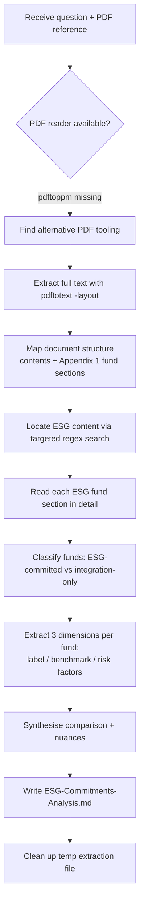
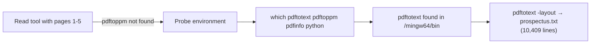
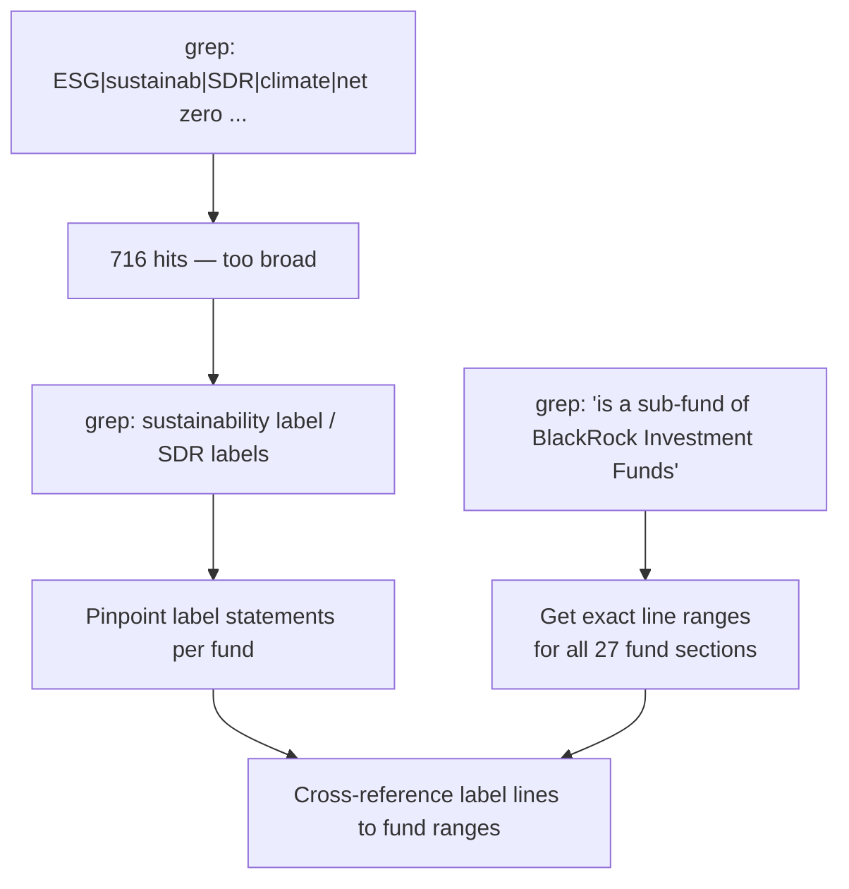
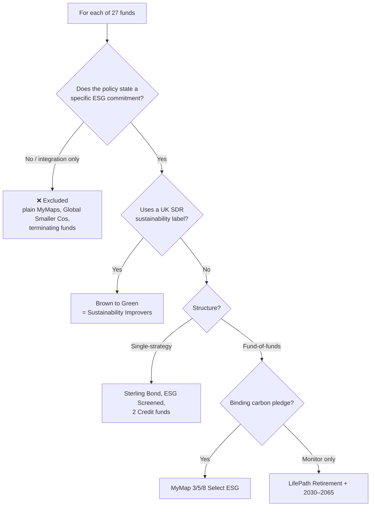
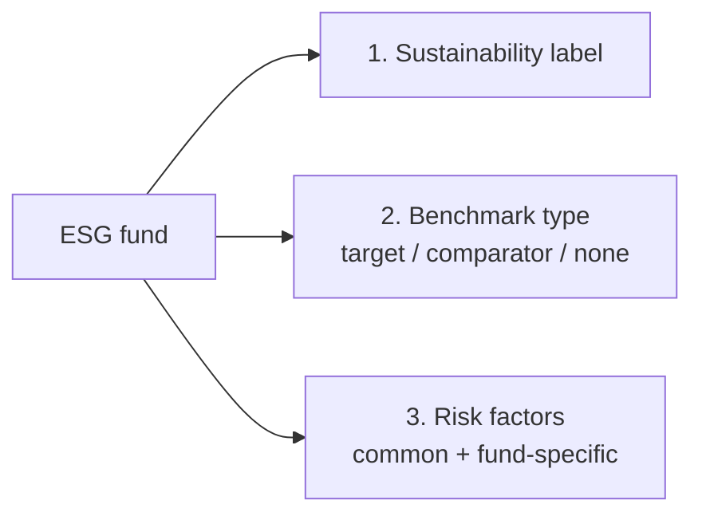

# Methodology — How the ESG Commitments Analysis Was Produced

This document records the process used to answer:
> *"Which funds have ESG-related commitments, and how do their sustainability labels, benchmarks and risk factors differ?"*
> Source: `context/blackrock-investment-funds-prospectus.pdf` (19 pages, BlackRock Investment Funds Prospectus, 15 June 2026).

The output of that work is [`ESG-Commitments-Analysis.md`](./ESG-Commitments-Analysis.md).

---

## 1. High-level workflow

---

## 2. Step-by-step narrative

### Step 1 — Attempt the expected tool, then adapt
The system flagged the PDF as too large to read at once and recommended the `Read` tool with a `pages` range. The first attempt failed because the underlying renderer (`pdftoppm`) was not installed on this Windows machine.

**Decision:** Rather than abandon the approach, I probed the environment for any usable PDF tooling.

- `pdftotext -layout` was chosen over plain extraction so that the prospectus's **two-column layout and tables** stayed legible.
- The text was written to a temporary working file (`prospectus.txt`) so it could be searched and read repeatedly without re-parsing the PDF.

### Step 2 — Understand the document structure before reading deeply
I read the contents page and the start of Appendix 1 to learn how the prospectus is organised, instead of reading linearly from page 1.

Key structural facts discovered:
- The Trust is an umbrella of **27 sub-funds**.
- General ESG approach lives in **§23 (Investment Objective/Policy)** and **§24 (Risk Considerations)**.
- Per-fund detail (objective, policy, ESG, benchmarks) lives in **Appendix 1 (p. 54+)**.

### Step 3 — Locate ESG content with targeted search, not brute-force reading
Reading all 10,000+ lines would be wasteful. Instead I used regex searches to jump to the relevant passages.

The **"is a sub-fund of…"** sentence appears once per fund, so searching it produced a clean index of every fund's start line — the backbone for navigating the rest of the document.

### Step 4 — Read each ESG-relevant fund section in detail
Using the line-range map, I read the funds that the label search had flagged, plus the general ESG and risk sections:

| Section read | Why |
|---|---|
| §23(c) ESG integration | Distinguish firm-wide *integration* from a fund-level *commitment* |
| §24(c)(viii) ESG risk factors | Common risk block shared by all ESG funds |
| Sterling Strategic Bond | Screens + carbon target + PEXT/NEXT pattern |
| ESG Screened & Selected Strategic Growth | Extra exclusions + ESG-Funds requirement |
| **Brown to Green Materials** | The only SDR-labelled fund |
| Systematic Multi Allocation Credit / Sterling Short Duration Credit | Credit-fund ESG variants |
| MyMap 3 (plain) vs MyMap 3 Select ESG | Isolate the ESG-vs-non-ESG difference |
| LifePath Retirement (representative) | Fund-of-funds monitoring model + Morningstar categories |

### Step 5 — Classify funds
Each fund was sorted using a consistent test.

### Step 6 — Extract the three comparison dimensions
For every ESG-committed fund I captured the same three attributes so they could be compared like-for-like:

### Step 7 — Synthesise and write up
Findings were assembled into the report: an executive summary, the which-funds list, a master comparison table, a dimension-by-dimension breakdown, and the key *binding-commitment vs monitoring* nuance.

### Step 8 — Clean up
The temporary `prospectus.txt` extraction file was deleted, leaving only the deliverable markdown.

---

## 3. Tools used

| Tool | Purpose |
|---|---|
| `Read` (pages) | Initial attempt (blocked by missing `pdftoppm`) |
| `Bash` → `pdftotext -layout` | Convert PDF to searchable, layout-preserving text |
| `Grep` (regex) | Locate ESG passages and index all fund sections |
| `Read` (offset/limit on the text file) | Deep-read specific fund and risk sections |
| `Write` | Produce the final markdown deliverable |
| `Bash` → `rm` | Remove the temporary extraction file |

---

## 4. Design choices & why they mattered

- **Adapt the toolchain rather than stop** — when `pdftoppm` was missing, switching to `pdftotext` kept the task moving with no loss of fidelity.
- **Index before reading** — using the repeating "sub-fund" sentence to map all 27 sections meant every later read was targeted, not exploratory.
- **Search, then read** — regex narrowed ~10,400 lines to the handful of passages that actually answered the question.
- **Compare like-for-like** — forcing every ESG fund through the same three-dimension template (label / benchmark / risk) is what made the differences visible.
- **Distinguish commitment from integration** — the central judgement call: firm-wide ESG *integration* is not an ESG *commitment*, which is why 13 of 27 funds were excluded.

---

## 5. Limitations

- Analysis reflects the **15 June 2026** edition only; the prospectus states ESG criteria "evolve and advance over time."
- The LifePath Target Date funds (2035–2065) were confirmed to share the LifePath Retirement model and were read representatively rather than each in full; their per-fund differences (glide-path vintage, Morningstar category) were verified separately.
- Detailed fee/share-class tables were out of scope for the ESG question and were not analysed.
