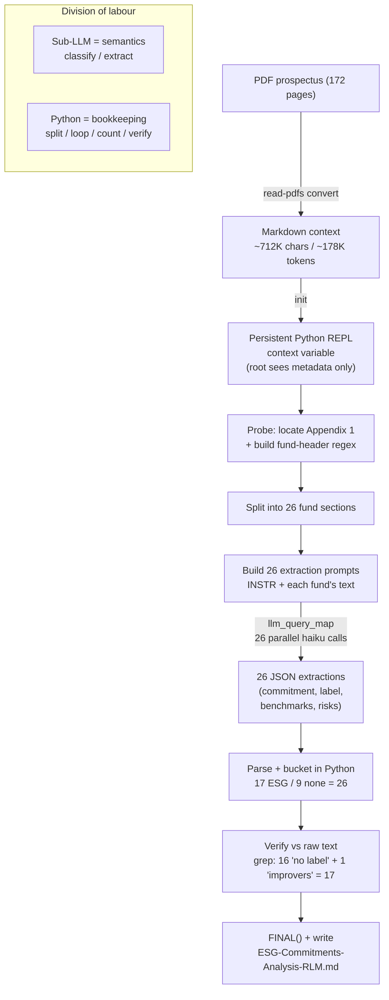

# How the RLM Answered the ESG Question — Step-by-Step

**Question answered:** *"Which funds have ESG-related commitments, and how do their sustainability labels, benchmarks and risk factors differ?"*
**Source context:** `blackrock-investment-funds-prospectus.pdf` → converted to Markdown (~712K chars / ~178K tokens, 172 pages).
**Output produced:** `ESG-Commitments-Analysis-RLM.md`

This document reconstructs the *actual* steps taken, recovered from the persisted REPL session (`.claude/rlm_state/state.pkl`) — the buffers, persisted variables, extraction prompt, and final answer it contains.

---

## The core idea

The prospectus is far too large to read into the conversation directly. So instead of reading it, the RLM loaded it as a `context` variable inside a **persistent Python REPL** and answered the question by *writing code* that sliced the document and fanned the **semantic** work out to a cheap sub-LLM (`haiku`), one call per fund. Python did the **bookkeeping** (locate sections, loop, parse, count, verify); the LLM did the **meaning** (classify each fund, extract its label/benchmarks/risks).

> The root model (this conversation) never saw the raw prospectus text — only metadata and the truncated stdout of the code it ran.

---

## The steps

### Step 0 — Convert the PDF to Markdown
The PDF was first converted to a token-efficient Markdown workspace (`blackrock-investment-funds-prospectus.md`, ~712K chars, with a page manifest). This is the "context" the RLM operates on.

### Step 1 — Initialise: load the context, read only its metadata
```
python rlm_repl.py init context/.../blackrock-investment-funds-prospectus.md
```
The REPL reported: `str (712,267 chars, ~172 pages, ~178K tokens est.)` plus a 600-char preview. **The full text was never pulled into the conversation.**

### Step 2 — Probe the structure
Small, cheap code located **Appendix 1 — "Details of each of the Funds"** (the per-fund detail region) by character offset and inspected the heading pattern. The document is Markdown with `## **Fund Name**` headers. A regex was built to find fund boundaries:
```python
fund_pat = re.compile(r'^##\s+\*\*([A-Z][^*]+?Fund(?:\s+\d{4})?)\*\*\s*$', re.MULTILINE)
```

### Step 3 — Decompose into one section per fund
Python split Appendix 1 into **26 self-contained fund sections** using the fund-header offsets — each a `{name, start, end, len, text}` record. This was checkpointed to a buffer: `"fund_sections built: 26 funds"`.

### Step 4 — Sub-query: classify & extract every fund in parallel
A single strict **extraction instruction** (`INSTR`) was written asking the sub-LM to return **JSON only** per fund, with keys:

| Key | What the sub-LM extracts |
|---|---|
| `esg_commitment` | `none` / `integration_only` / `binding_esg` |
| `esg_summary` | ≤30 words on *how* ESG features (screens, tilts, theme…) |
| `sdr_label` | The fund's own UK SDR label statement (or "No UK sustainable investment label") |
| `benchmarks` | List of `{name, role, esg_benchmark:true/false}` |
| `esg_risk_factors` | ESG-specific risk factors named in that section |

One prompt was built per fund (`INSTR` + that fund's text → **26 prompts**) and all were fired **in parallel**:
```python
raw_outs = llm_query_map(prompts)   # 26 concurrent haiku calls, order preserved
```

### Step 5 — Parse & aggregate in Python (not in the LLM)
The 26 JSON replies were parsed into structured records (`parsed`), then bucketed **arithmetically in Python**:
```python
esg  = [f for f in parsed if f['esg_commitment'] == 'binding_esg']   # → 17
none = [f for f in parsed if f['esg_commitment'] == 'none']          # →  9
# (17 + 9 = 26 → full coverage confirmed)
```

### Step 6 — Verify against the raw text (cross-check, don't trust)
The headline claims were re-checked programmatically by grepping the actual context, not by trusting the LLM:
- **16** exact occurrences of *"does not have a UK sustainable investment label"*
- **1** *"sustainability improvers"* label (Brown To Green Materials Fund)
- → **17** ESG funds total, reconciling to all 26. The one-vs-sixteen label split was confirmed from source.

### Step 7 — Return the answer and write the report
A compact answer was set in the REPL via `FINAL(...)`, and the full comparison (the 17-fund table, the labels/benchmarks/risk-factors analysis, and the completeness caveat) was written out to `ESG-Commitments-Analysis-RLM.md`.

---

## Flow diagram



## Root ↔ REPL ↔ sub-LM interaction

```mermaid
sequenceDiagram
    participant Root as Root model (this chat)
    participant REPL as Python REPL (context var)
    participant Sub as Sub-LLM (haiku ×26)

    Root->>REPL: init(context.md)
    REPL-->>Root: metadata only (size, preview)
    Root->>REPL: exec — probe & locate Appendix 1
    REPL-->>Root: structure (## **Fund** headers)
    Root->>REPL: exec — split into 26 sections
    REPL-->>Root: "26 funds" (buffer)
    Root->>REPL: exec — build 26 prompts, llm_query_map
    REPL->>Sub: 26 prompts in parallel
    Sub-->>REPL: 26 JSON extractions
    REPL-->>Root: coverage counts (truncated stdout)
    Root->>REPL: exec — parse, bucket (17/9), verify via grep
    REPL-->>Root: 17 ESG / 9 none; labels 16+1=17 ✓
    Root->>REPL: FINAL(answer)
    REPL-->>Root: answer stored
    Root->>Root: write ESG-Commitments-Analysis-RLM.md
```

---

## Why it was done this way

- **The context never entered the conversation window.** Only `init` metadata, small probes, and truncated stdout were ever visible to the root — which is what lets a 178K-token document be processed without dumping it into chat.
- **Semantics vs. arithmetic were kept separate.** The LLM classified and extracted per fund (meaning); Python located sections, looped, counted, and verified (bookkeeping). Counting with the LLM, or classifying with keyword `if`-checks, are the documented failure modes this avoids.
- **Calls were batched & parallel.** One fat call per fund (26 total), run concurrently via `llm_query_map`, rather than thousands of tiny calls.
- **Full coverage was checked, then cross-verified.** `17 + 9 = 26` confirmed every fund was processed, and the headline label split was re-derived directly from the source text rather than taken on trust.

*Reconstructed from the live RLM session state (`.claude/rlm_state/state.pkl`): 26 `fund_sections`, the `INSTR` extraction prompt, 26 `prompts`/`raw_outs`/`parsed` records, the `esg` (17) and `none` (9) buckets, and the stored `FINAL` answer.*
